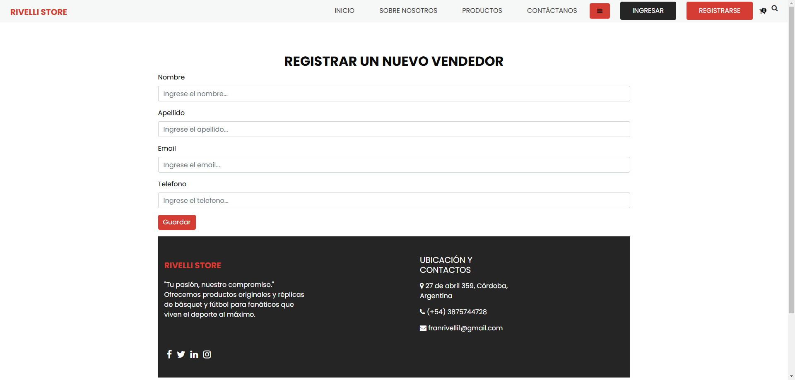

# Proyecto: Tienda Deportiva - Rivelli Store

Este proyecto es una página web para una tienda deportiva con diversas funcionalidades implementadas utilizando Django y Bootstrap. A continuación, se detalla el orden en el que se deben probar las funcionalidades y el contenido de cada página.

## Índice

1. [Requisitos Previos](#requisitos-previos)

2. [Instalación](#instalación)

3. [Ejecución del Proyecto](#ejecución-del-proyecto)

4. [Páginas y Funcionalidades](#páginas-y-funcionalidades)

    1. [Página Inicio](#1-página-de-inicio)

    2. [Página Sobre Nosotros](#2-página-sobre-nosotros)

    3. [Página Productos](#3-página-productos)

    4. [Páginas Ver Vendedores y Ver Clientes](#4-páginas-ver-vendedores-y-ver-clientes)

    5. [Página Contáctanos](#5-página-contáctanos)

5. [Orden de Prueba](#orden-de-prueba)

## Requisitos Previos
- Python 3.10 o superior
- Django 4.0 o superior
- Bootstrap 5 integrado en el proyecto

## Instalación

1. Clonar el repositorio

```py
git clone https://github.com/usuario/rivelli-store.git
cd rivelli-store
```

2. Instalar las dependencias:

```py
pip install -r requirements.txt
```

3. Realizar las migraciones para configurar la base de datos:

```py
python manage.py makemigrations
python manage.py migrate
```

## Ejecución del Proyecto

1. Ejecuta el servidor de desarrollo:

```py
python manage.py runserver
```

2. Acceder a la página web en el navegador en la URL:

```py
http://127.0.0.1:8000/
```

## Páginas y Funcionalidades

Todas las páginas cuentan con una barra de navegación en la parte superior, con botones para dirigirse a otras páginas y un menú desplegable para ingresar a las páginas de **vendedores** y **clientes**

En el pie de cada página se encuentran `Botones de redes sociales` que redirigen a las diferentes redes sociales e información de contacto.

### 1. Página de Inicio


#### Ruta: `/`

En la **página principal** se puede visualizar:

- Carrusel de imagenes al principio y otro de opiniones de clientes al final, ambos funcionales.

- Botones disponibles:

    - `Comprar ahora` →  Redirige a la página de **productos**.
    
    - `Pedir cotización` → Redirige al **formulario de contacto**.

    - `Ver todo` → Redirige a la página de **productos**.

### 2. Página Sobre Nosotros


#### Ruta: `/about/`

En la **página Sobre Nosotros** se encuentra:

- Una breve descripción sobre la tienda.
- Botón de `Comprar ahora`, que redirige a la página de **productos**

### 3. Página Productos


#### Ruta: `/product/`

Características de la **página Productos**:

- Muestra en `HTML` de los productos.

- Botones para ir a las páginas de: `Zapitllas`, `Botines`, `Ropa` y `Otros productos`:


    |  |  |
    | --- | --- |
    | |  |

    Cada una de estas páginas cuentan con:

    - **Tablas** para visualizar los productos registrados con sus detalles.

    - Una **barra de búsqueda** para buscar según el **nombre** o **modelo** del producto.

    - Un **botón** que redirige a un formulario para registrar un nuevo producto, según el tipo que corresponda: 

    |  |  |
    | --- | --- |
    | |  |

    En estas páginas hay:

    - Campos para completar con ``Modelo/Producto``, `Precio`, ``Talle``, ``Vendedor``, ``Descripción`` y cargar una ``Imagen``.

    - Una vez que se hayan cargado los datos correctamente, haciendo clic en el botón `Guardar`, se redirecciona al usuario a una página de confirmación de registro de producto exitoso.
    
    

    Por útlimo, haciendo clic en el botón `Regresar a sección...`, se redirecciona a la página **Zapatillas**, **Botines**, **Ropa** u **Otros Productos** (según corresponda), donde se puede visualizar el producto recientemente registrado.

### 4. Páginas Ver Vendedores y Ver Clientes

#### Rutas: `/vendedores/` y ``/clientes/``

|  |  |
| --- | --- |

Tienen la misma estética y funcionalidad que las páginas de **Zapatillas**, **Botines**, **Ropa** y **Otros Productos**. Cuentan con:

- **Tablas** para visualizar los **Vendedores** o **Clientes** registrados con sus detalles.

- Una **barra de búsqueda** para buscar según el **apellido** de cada **Vendedor** o **Cliente**.

- Un **botón** que redirige a un formulario para registrar un nuevo **cliente** o **vendedor**, según el tipo que corresponda: 

|  |  |
| --- | --- |

En estas páginas hay:

- Campos para completar con ``Nombre``, `Apellido`, ``Email`` y ``Telefono`` del nuevo **vendedor** o **cliente**.

- Una vez que se hayan cargado los datos correctamente, haciendo clic en el botón `Guardar`, se redirecciona al usuario a una página de confirmación de registro de **vendedor** o **cliente** exitoso.


Por útlimo, haciendo clic en el botón `Regresar a sección...`, se redirecciona a la página **Ver Vendedores** o **Ver Clientes** (según corresponda), donde se puede visualizar el nuevo registro.

### 5. Página Contáctanos


#### Ruta: `/contact/`

Esta página contiene un formulario para que el usuario se ponga en contacto con la tienda y pueda, por ejemplo, pedir una cotización.

El registro que realiza el usuario se puede visualizar en la base de datos `db.sqlite3` en la tabla `app_tienda_contacto`  o en la ruta `/admin/app_tienda/contacto/` ingresando con el superusuario **fran** y la contraseña **1**.

## Orden de prueba

Para probar las funcionalidades que la consigna de la *Tercera Entrega* solicita, se pueden seguir los siguientes pasos:

1. Dirigirse a la página de **Productos** y luego a cualquiera de las otras páginas disponibles de productos (**Zapatillas**, **Botines**, **Ropa** u **Otros Productos**).

---

2. Usar la herramienta de búsqueda para encontrar alguno de los productos ya registrados. La búsqueda se hace según el modelo en las páginas de **Zapatillas**, **Botines** y **Ropa**, y según el producto en la página de **Otros Productos**.

---

3. Luego de verificar la funcionalidad de la herramienta de búsqueda, hacer clic en el botón de `Agregar Zapatila`, por ejemplo, para cargar un nuevo producto. 

    Allí se pedirá ingresar ``Modelo/Producto``, `Precio`, ``Talle`` (si corresponde), ``Vendedor``, ``Descripción`` y cargar una ``Imagen``.

    Todos los campos deben ser completados, a excepción de la `Descripción`.

    Una vez completados todos los campos, hacer clic en el botón `Guardar`. Luego se redirigirá a una página donde se muestra el mensaje de **Registro Exitoso**. Por último, hacer clic en el botón de `Regresar a sección...` para volver a la página seleccionada donde realizó la carga de un nuevo producto.

---

4. Ahora, en la página **Contáctanos**, podemos encontrar un formulario para que el usuario envíe un mensaje al staff de la tienda. 

    Si se decide registrar un mensaje, se lo puede ver registrado en la base de datos `db.sqlite3` en la tabla `app_tienda_contacto` o en la ruta `/admin/app_tienda/contacto/` ingresando con el superusuario **fran** y la contraseña **1**.

---

5. Para finalizar, haciendo clic en el `menú desplegable`, podemos dirigirnos a una de estas dos páginas: **Ver Vendedores** o **Ver Clientes**.

    Aquí repetimos el mismo procedimiento que en las páginas de los diferentes productos:

    1. Usar la herramienta de búsqueda para encontrar alguno de los vendedores o clientes ya registrados. La búsqueda se realiza según el **apellido**.

    2. Para agregar un nuevo vendedor o cliente, hacer clic en el botón `Agregar...`

    3. En esa página habrá un formulario en el que se deberán llenar los campos ``Nombre``, `Apellido`, ``Email`` y ``Telefono``. En ambos casos los campos a rellenar son los mismos.

    4. Una vez completados, hacer clic en el botón `Guardar` para cargar el nuevo vendedor o cliente. Se redirigirá a la página de **Registro Exitoso** y por último, clickeando en el botón `Regresar a sección...` será redirigido a la página correspondiente.